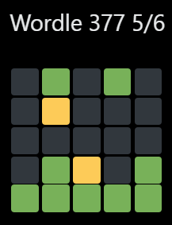
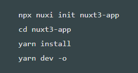
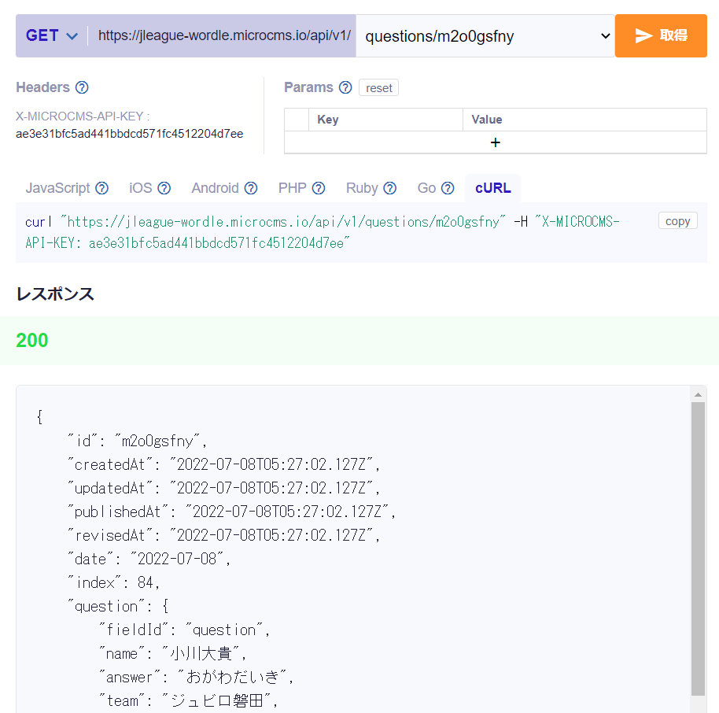
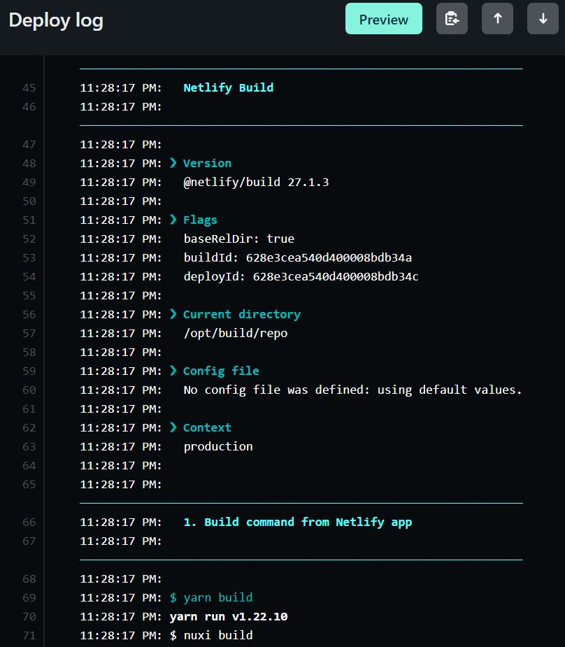
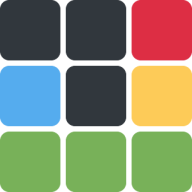

<!-- 
_class: title__text
_footer: ''
_paginate: false
-->
# Nuxt3(RC)とmicroCMSで<br />WordleのJリーグ版を作ってみたお話

cslf-fh

---

## お品書き:sushi:

- 自己紹介
- 作ったもの
  - そもそもWordleって？
- 作ろうと思ったきっかけ
- 使用技術
  - 技術紹介
- 本ゲームの構成
- さいごに

---

<!-- _class: introduction__list -->

## 自己紹介:smile:

- _名前_ cslf-fh
- _SNSとか_ [@cslf_fh](https://twitter.com/cslf_fh)
- _SNSとか_ [Webページ](https://cslf-fh.web.app):desktop_computer:
- _プログラミング歴_ 2020.8～:keyboard:
- _趣味_ サッカー:soccer: 将棋:chess_pawn: ゲーム:video_game:

---

## 作ったもの:page_facing_up:

#### [先ずは本家を表示](https://www.nytimes.com/games/wordle/index.html)

#### [次に作ったものを表示](https://jleague-wordle.netlify.app)

---

## 作ったもの:page_facing_up:

Q. そもそもWordleって？

A. 5文字の英単語を6回の試行で推測するゲーム



---

## 作ったもの:page_facing_up:

- :green_square: 単語の位置が正しい
- :yellow_square: 単語の位置は正しくないが、
お題に含まれている
- :black_large_square: お題に含まれていない


---

## 作ったもの:page_facing_up:

これのJリーグ版が本ゲームとなります！

---

<!-- _class: centering -->

## 作ろうと思ったきっかけ💡

それは…

# 英語わかんない！

---

<!-- _class: centering -->

## 作ろうと思ったきっかけ💡

とある日のWordleにて…

__

---

## 作ろうと思ったきっかけ💡

「Wordle 日本語」でググってみたものをいくつか遊んでみたが
今一つしっくりこず…

**じゃあ自分で作ってしまえ！**

ってことで作り始めました。

---

## 作ろうと思ったきっかけ💡

Q. 何でJリーグなんですか？

A. **サッカーが、Jリーグが好きだからです！Jはいいぞ！**:soccer:

---

## 作る前に考えたこと🤔

1. 見た目:eyes:
1. お題の単語数:pen:
1. 英語と日本語の違い🇺🇸🇯🇵
1. お題のデータ:floppy_disk:

---

<!-- _class: centering -->

## 作る前に考えたこと🤔

#### 1. 見た目:eyes:

# 本家を~~パクる~~参考にする

---

## 作る前に考えたこと🤔

#### 2. お題の単語数:pen:

何となく頭に思い浮かんだ選手2名が6文字だったので、
6文字に決定！

---

<!-- _class: centering -->

## 作る前に考えたこと🤔

#### 3. 英語と日本語の違い🇺🇸🇯🇵

__

---

<!-- _class: centering -->

## 作る前に考えたこと🤔

#### 3. 英語と日本語の違い🇺🇸🇯🇵

# ヒントを増やして何とかしよう！

---

<!-- _class: centering -->

## 作る前に考えたこと🤔

#### 3. 英語と日本語の違い🇺🇸🇯🇵

e.g. お題が「たなかさとし」

__

---

<!-- _class: centering -->

## 作る前に考えたこと🤔

#### 4. お題のデータ:floppy_disk:

# 人力！💪💪💪

---

## 作る前に考えたこと🤔

#### 4. お題のデータ:floppy_disk:

[ファミ通さん](https://www.famitsu.com/news/202203/25255891.html)にて、作者であるジョシュ・ウォードル氏の講演内容が
記事になってます:smile:
以下引用:pen:

> そこで絞り込みを行うことになるのだが、頻出単語などを抽出していくアルゴリズム的手法はうまくいかず、結局選んだのは人力作戦。当時何か没頭するものを必要としていたパートナーに「知ってる」「知らない」「多分知ってる」の三択で答えるシステムを作り、分類してもらったのだとか。

---

<!-- _class: list-image -->

## 使用技術:wrench:

- フロントエンド : 
- データベース？ : 
- ホスティング : 
- スタイリング :  / 

---

## 使用技術:wrench:


- セットアップが楽！
- お手軽にAPIサーバが作れる！
  - 自動的に型検知もしてくれる！
- オートインポートが楽！
- setup記法がいい！

etc...



---

## 使用技術:wrench:


- 日本製ヘッドレスCMS！
- レスポンスの確認が簡単！
- リッチエディタも使える！
  - ブログ作成にうってつけ！
- Webhookも豊富！

etc...



---

## 使用技術:wrench:


- Githubのリポジトリとの連携が簡単！
  - プッシュするだけでCI/CDができる！
- Webhookの設定も簡単！

etc...



---

## 使用技術:wrench:


```html
<button class="w-10 h-10 bg-blue-500">ボタン</button>
```


- コンポーネントが豊富！
- テーマも豊富！


---

<!-- _class: centering heading-image -->

## 本ゲームの構成

- お題の作成
リクエストの日付を見て判断（無ければ追加）

__

---

<!-- _class: heading-image -->

## 本ゲームの構成

```ts
①リクエスト
const { data } = await useFetch('/api/foo');
```

```ts
②お題の取得
const bar = await $fetch<TYPE>(endpoint, {
  baseURL: baseUrl,
  headers: {
    'X-MICROCMS-API-KEY': apiKey,
  },
});
```


---

<!-- _class: heading-image -->

## 本ゲームの構成

```ts
④お題を追加
await $fetch(endpoint, {
  method: 'POST',
  headers: {
    'Content-Type': 'application/json',
    'X-MICROCMS-API-KEY': apiKey,
  },
  body: {
    // お題の情報
  },
});
```

```ts
⑤レスポンス
return { contents: bar };
```


---

<!-- _class: centering -->

## さいごに:rhinoceros:

こんな感じでもそれっぽい物は作れます。あと…

# Webは楽しい！

---

<!-- _class: list-image -->

## 謝辞🙏

- さくらのコミュニティ 様 : [@sakura_users](https://twitter.com/sakura_users)
- Atsushi 🇯🇵 DevRel Meetup in 🗼 7/6 様 : [@goofmint](https://twitter.com/goofmint)
- Marp 様 : [https://marp.app](https://marp.app)
- diagrams. net 様 : [https://www.diagrams.net](https://www.diagrams.net/)
- 素晴らしいスクリーンショットとスクリーンレコーダー 様 : [https://www.awesomescreenshot.com](https://www.awesomescreenshot.com)
- WEBM GIF 変換 - ビデオファイルをオンラインで変換する 様 : [https://www.aconvert.com/jp/video/webm-to-gif](https://www.aconvert.com/jp/video/webm-to-gif/)